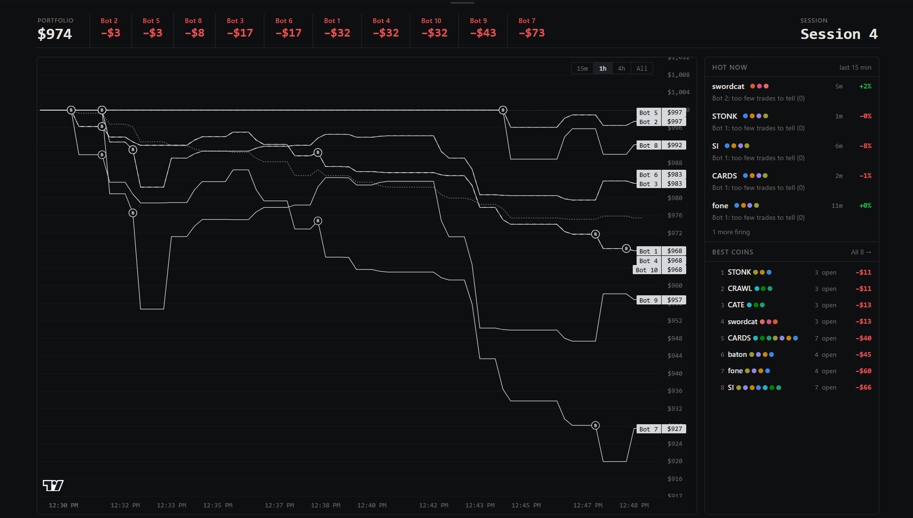
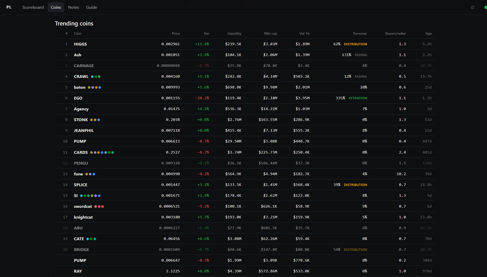
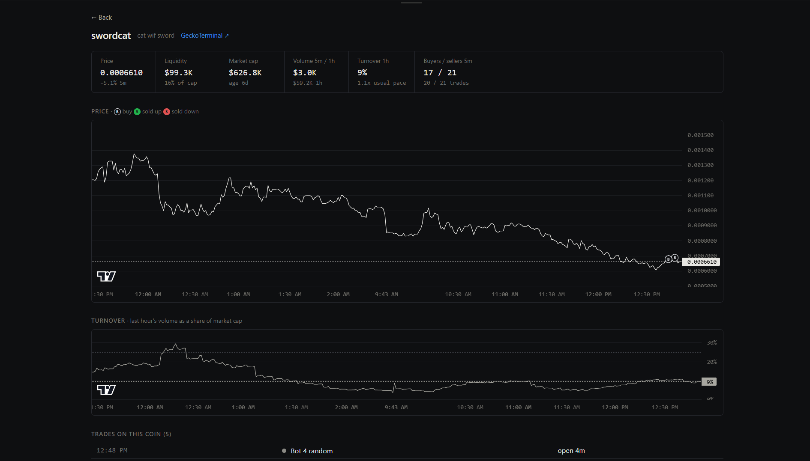
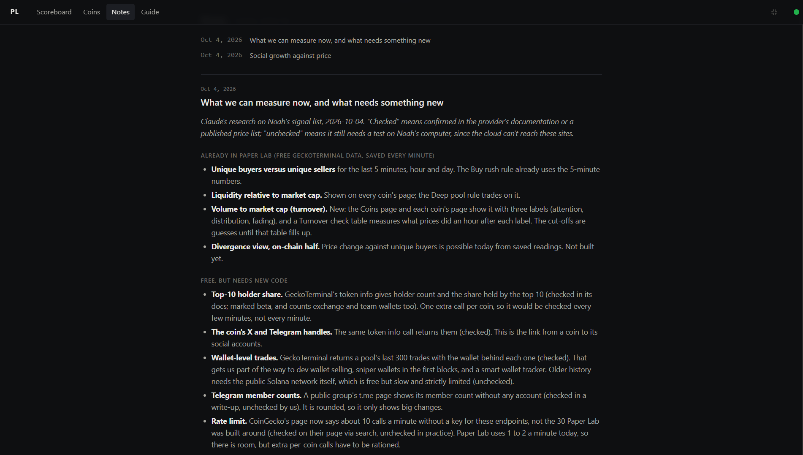

# Paper Lab

Paper Lab watches trending Solana memecoins and lets ten trading bots practice on them with pretend money. Each bot follows one simple rule, like "buy when far more wallets are buying than selling." Every bot also has a twin that buys random coins with the same money and the same exits. If a bot can't beat its random twin, its rule is probably luck.

> **Paper trading only.** Paper Lab never connects to a wallet, never places a real trade, and makes no promise of profit. Memecoins are extremely risky, and most rules that look good early turn out to be noise.

## The scoreboard

The home screen. Across the top is your portfolio and each bot's profit or loss, best first. The chart shows every bot's balance over time, with a B where it bought. The dotted line is the random pickers: a bot below it is doing worse than chance. **Hot now** lists coins a bot's rule fired on in the last 15 minutes, with that bot's real hit rate (or "too few trades to tell"). **Best coins** ranks every coin the bots bought this session by profit. Sessions (top right) restart every bot at $1,000.

## Trending coins

Every trending Solana coin in one table: price, 5 minute change, liquidity, market cap, hourly volume, buyers per seller and age. Colored dots show which bots hold the coin right now. Dimmed coins have too little liquidity for the bots to touch. **Turnover** is the last hour's trading as a share of the coin's value, tagged Attention (new buyers coming in), Distribution (early holders may be selling) or Fading (interest leaving). These tags are first guesses that Paper Lab is still testing, so treat them as hints, not odds.

## A single coin

Click any coin to see it up close. The top row gives the numbers that matter most at a glance: price, liquidity, market cap, volume, turnover and buyers versus sellers in the last 5 minutes. The price chart marks every bot buy and every sell, green when the trade made money and red when it lost. The turnover chart below shows whether trading interest is rising or cooling. At the bottom is every paper trade on this coin, random picks included.

## Research notes

A dated notebook of ideas and findings, newest first. Notes cover what Paper Lab can measure today and what new data might help. Each note is a plain text file in the [`notes/`](notes) folder, so you can also read them right here on GitHub. A **Guide** page in the app explains every number and label in plain words.

## How to read the results

- **Beat the twin, not zero.** In a falling market every bot loses. What matters is whether a bot loses less, or wins more, than its random twin.
- **Wait for enough trades.** Paper Lab says "too few trades to tell" until a rule has a real track record. A few lucky trades prove nothing.
- **Costs are included.** Every pretend trade pays fees and slippage, and buys a minute after the signal, the way a person copying it by hand would. That makes results more honest, and usually worse.

## Getting started

Paper Lab runs on your own computer and is free to use. It needs Node (a free program) and takes about 10 minutes to set up the first time. Follow the step-by-step [setup guide](SETUP.md).

## Under the hood

Built with Node and its built-in SQLite database, with no build step. Market data comes from the free [GeckoTerminal](https://www.geckoterminal.com) API, checked every 60 seconds. Charts use [TradingView Lightweight Charts](https://www.tradingview.com/lightweight-charts/). It only runs on your own computer (localhost). Developer details, the full list of bots and their rules, and how to add a new rule are in [docs/DEVELOPERS.md](docs/DEVELOPERS.md).
